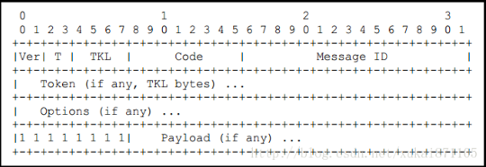
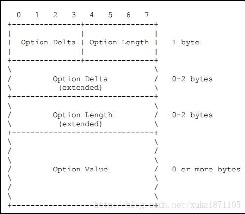
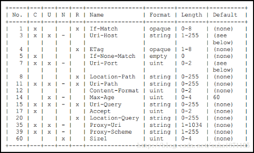

# CoAP协议调研

## CoAP协议概述

CoAP协议（the Constrained Application Protocol ）全称为受限应用协议，是一种应用于嵌入式设备之间通信的类HTTP协议。

由于嵌入式设备的计算能力非常有限，应用于PC机的常规HTTP协议体量显然过大。因此，CoAP协议被设计出来用于让小设备也能接入互联网。

CoAP是一种应用层协议，它运行于UDP协议之上而不是像HTTP那样运行于TCP之上。CoAP协议非常小巧，最小的数据包仅为4字节。

## CoAP协议体

和其他TCP IP协议簇中的协议一样，CoAP协议总是以“头”的形式出现在负载之前，而负载和CoAP头之间使用单字节0xFF分离。

具体的分析可以参考[这篇文章](http://network.chinabyte.com/333/13351333.shtml)。

整个CoAP协议的形式与HTTP协议的格式非常类似，但是由于本身设计长度的限制，每个字段被设计为以bit为单位，而不是HTTP的byte。

下面几张图展示了CoAP协议的基本格式：

code字段可以被理解为HTTP协议中的请求方法或状态码，分为前3位和后5位，通常记为`c.dd`的形式。

| code   | 方法名            |
| ------ | -------------- |
| `0.01` | `GET`          |
| `0.02` | `POST`         |
| `0.02` | `PUT`          |
| `0.03` | `DELETE`       |
| `1.xx` | 类似HTTP 1xx的状态码 |
| `2.xx` | 类似HTTP 2xx的状态码 |
| `3.xx` | 类似HTTP 3xx的状态码 |
| `4.xx` | 类似HTTP 4xx的状态码 |
| `5.xx` | 类似HTTP 5xx的状态码 |

option字段类似HTTP请求中的请求头，格式如下图：

Option Delta代表选项编号，每个编号代表的请求头对应如下图：

