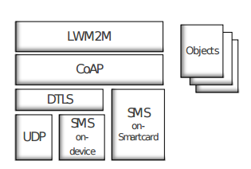

# 文档名缩写

| abbr  | full                              |
| ----- | --------------------------------- |
| AC    | Application Characteristics       |
| AD    | Architecture Document             |
| API   | Application Programming Interface |
| ASN   | Abstract Syntax Notation          |
| DDF   | Device Description Framework      |
| DDS   | Data Definition Specification     |
| DTD   | Document Type Definition          |
| ER    | Enabler Release                   |
| ERELD | Enabler Release Definition        |
| ERP   | Enabler Release Package           |
| ETR   | Enabler Test Requirements         |
| ETS   | Enabler Test Specification        |
| EVP   | Enabler Validation Plan           |
| MO    | Management Object                 |
| OD    | Overview Document                 |
| OMA   | Open Mobile Alliance              |
| RD    | Requirement Document              |
| RR    | Reference Release                 |
| RRELD | Reference Release Definition      |
| RRP   | Reference Release Package         |
| SUP   | Support Document                  |
| TFP   | Test Files Package                |
| TS    | Technical Specification           |
| WIDL  | Web Interface Definition Language |
| WSDL  | Web Interface Definition Language |
| XML   | Extensible Markup Language        |
| XSD   | XML Schema Document               |

# 协议角色

1. LWM2M客户节点（client），作为协议中的终端节点，通过与服务器进行通信来执行各种操作
2. LWM2M服务器（server），作为*M2M服务*（M2M service）或*网络服务*(network service)提供者的一部分。
3. LWM2M启动器（bootstrap server）,为客户节点的注册流程提供支持
4. 芯片卡（smart card），带有微处理器的卡片，为系统提供安全功能

# 协议栈

通信的协议栈可以描述为（从上到下依次接近底层）：

* LWM2M代表有效数据载荷（Efficient Payload）。
* CoAP（the Constrained Application Protocol）是约束应用协议，是一个类HTTP的应用层协议，建立在UDP之上。
* DTLS（Datagram Transport Layer Security）是数据包传输层安全性协议，与TLS相区别，适用于UDP，是TLS针对UDP协议的修改版。
* SMS（Short Message Service）全称*短消息服务*，通常意义上的手机短消息是它的一个子集。由于短消息本身并没有经过加密，一次传输过程中必须经过DTLS对数据进行加密传输。但是基于智能卡的SMS服务，由于智能卡本身具有加密传输功能，因此不再需要额外的加密服务。

# 协议接口说明

整个协议被设计为一个CS架构，为了实现client和serve之间的通信和操作，OMA定义下列4种接口：

1. LWM2M-1 Bootstrap
2. LWM2M-2 Clinet Registration 
3. LWM2M-3 Device Management and Service Enablement
4. LWM2M-4 Information Reporting

每一种接口都定义了若干操作，所有的操作都可以被分为*上行操作*（uplink）和*下行操作*（downlink）。上行操作代表数据从client到server，而下行操作则代表数据从server到client。

Bootstrap操作，当client启动时应当遵循的接口规范：
| 操作名称              | 操作类型     | 说明                      |
| ----------------- | -------- | ----------------------- |
| Bootstrap Request | uplink   | 向server发起启动请求           |
| Write             | downlink | server向client输入一些启动必要信息 |
| Delete            | downlink |                         |
| Bootstrap Finish  | downlink | 告知client启动流程结束          |

Client Registration操作，注册client应当遵循的规范：
| 操作名称        | 操作类型   | 说明     |
| ----------- | ------ | ------ |
| Register    | uplink |        |
| Update      | uplink | 更新节点信息 |
| De-Register | uplink |        |

Device Management and Service Enablement操作，定义了一系列设备和服务管理的操作：
| 操作名称            | 操作类型     | 说明           |
| --------------- | -------- | ------------ |
| Read            | downlink |              |
| Write           | downlink |              |
| Excute          | downlink | 命令client执行操作 |
| Create          | downlink | 创建实体         |
| Delete          | downlink | 删除实体         |
| Write Attribute | downlink | 修改实体属性       |
| discover        | downlink | 获取实体属性或者实体资源 |

Information Reporting操作，事件的发布和监听接口：
| 操作名称           | 操作类型     | 说明                    |
| -------------- | -------- | --------------------- |
| Observe        | downlink | server告知client需要监听的事件 |
| Cancel Observe | downlink | 不再监听某一事件              |
| Notify         | uplink   | client告知server某一事件发生  |

