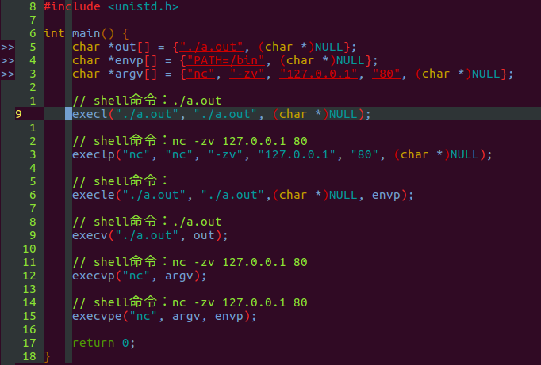

# exec函数族

## exec函数族的作用

exec函数族中的成员用于指定一个可执行程序（或者一个shell命令），将当前进程替换为制定的可执行程序（原进程会消失，其内存空间不会被回收而是被替换为新的进程）。

## exec函数族的成员

```c
#include <unistd.h>

extern char **environ

int execl(const char *path, const char *arg1, .../* (char *)NULL */);

int execlp(const char *file, const char *arg1, .../* (char *)NULL */);

int execle(const char *path, const char *arg1, .../* (char *)NULL, char * const envp[]*/);

int execv(const char *path, char * const argv[]);

int execvp(const char *file, char * const argv[]);

int execve(const char *path, char * const argv[], char * const envp[]);

int execvpe(const char *file, char * const argv[], char * const envp[]);
```

## exec函数族的返回值

exec函数族执行成功时，不会有返回值（原进程已经消失了），而执行失败时在原进程中返回-1并设置errno。

exec函数族使用注意事项——定位新进程

exec在定位将要执行的进程时，会采用两种方式，对应第一个参数：

使用相对路径或绝对路径，使用这种方式的函数，在函数命中凡是不包含字母p的，都是采用这种方式。例如：`execl("../a")`;
不仅使用路径定位的方式，对于第一个参数不含有"/"字符的，还会根据shell的PATH变量来搜索可执行文件或命令。例如：`execlp("ls")`会执行shell命令ls，而`execlp("./ls")`则会执行当前目录下的ls程序

## exec函数族使用注意事项——为新进程传递参数

exec为新进程传递参数有两种方式，对应第二个参数：

一种是将每一个参数依次列出，使用这种方式的函数，函数名中会包含字母l（list），例如：`execl("./a", "./a", "-f", "xx.txt". (char *)0)`，它等同于在shell中使用命令`./a -f xx.txt`

另一种方式是将所有参数放在一起`char *argv[]`中，使用这种方式的函数，函数名会包含字母v（vector），例如：`execv("./a", ["./a", "-r", (char *)NULL])`

另外，任何exec函数在传递参数时，第一个参数都应该是是可执行文件本身（类似于shell脚本的第一个参数是自己一样）。另外，两种形式的参数列表都应当以`(char *)NULL`结尾，如果没有参数，那么`(char *)NULL`必须省略。

## exec函数族使用注意事项——为新进程指定环境变量

如果要为新的进程指定shell环境变量，那么应该采用函数名中含有字母e（environment）的函数，即execle()和execvpe()。对应函数的第三个参数，同样的，这个环境变量数组envp的最后一个值应当是`(char *)NULL`。其它的exec函数使用外部变量`extern char **environ`作为环境变量。注意，execle可以不指定环境变量，此时它等同于execl；但execvpe必须三个参数全齐。

## 示例



## 一点注意事项

可以看到上图中变量定义被标红，这是由于字符串常量被转化为了普通可更改的char类型，但实际上只有在c++11中才不允许这样的转化，所以编译是可以通过的
在ubuntu man page中出现的execvpe这个函数在使用时，编译器会提示warning，显示函数被隐式声明，实际上在查看了头文件的声明后发现，在头文件中实际上声明了execve这个并没有在Man page中提到的函数，使用这个函数不会产生上述warning。execvpe这个函数只有在`__USE_GNU`这个宏被定义后，才会被定义（虽然忽略这个warning程序也是可以正常运行的）。


