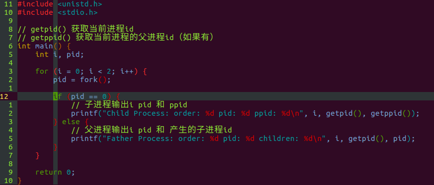
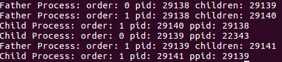

# fork函数

## fork函数的作用

fork函数在linux中用于为当前进程创建一个子进程，子进程拥有与父进程完全相同但独立于父进程的内存空间。这意味着，子进程是父进程的拷贝（绝大多数内容是相同的，一些内容比如进程号、信号等是不同的），但由于子进程的内存空间独立于父进程，子进程进行的操作不会影响到父进程。

## fork的函数原型

```c
#include <unistd.h>

pid_t fork(void) 
```

## fork函数的返回值

返回值类型pid_t通常是一个int，实现与系统相关。fork函数的返回值非常特殊，这个函数会分别在父进程和子进程中各返回一次（也就是一次调用，返回两次）。在父进程中，fork函数会返回子进程的pid；在子进程中返回0。

## 深入理解fork函数——子进程是父进程的拷贝

初次接触fork函数的人，可能都有这样的疑问——新产生的进程究竟是从哪里开始的执行的？是从原始代码的第一句开始重新执行，还是从fork函数的调用处开始执行的？

可以预见，若是采用第一种方式，将会导致很多问题。在linux中，新产生的子进程将会保持父进程的执行状态，从fork函数的调用点开始继续执行，这也印证了“子进程是父进程的拷贝”这一点。

下面举一个非常棒的例子来帮助理解“子进程是父进程的拷贝这句话。

试考虑下面代码会产生多少条（或者怎样的）输出？



这个程序进行两次循环，每次循环进行一次fork，然后根据当前进程是父进程还是子进程给出不同的输出。下面给出程序的输出结果：



分析上图，我们可以绘制出这样一个进程派生图：


这意味着，关于fork我们可以总结出以下结论:

子进程会从父进程调用对应fork的地方开始执行
子进程可以继续派生新的进程，第二级子进程的行为与之前一致
fork就像分裂一样，分裂以后父子进程分别独立的从同一个地方继续向下执行
进程间执行顺序不确定

## 深入理解fork函数——优化

linux一大特色即是可以迅速的创建新的进程，虽然对用户来说似乎子进程与父进程互有独立的内存空间，但是在子进程创建之初，子进程和父进程实际上被实现为共享同一个内存空间。直到任意一方对内存空间进行了修改，linux才会为子进程创建独立的内存空间并复制相应数据。

内核进行这种优化，是因为拷贝内存空间是一个非常耗费资源的做法，但是很多情况下，我们fork新的进程是为了调用exec族函数让子进程转化为一个新的进程（这个新的进程会占用原本子进程的内存空间，并替换里面所有的数据），在这种情况下进行数据的拷贝是没有任何意义的。而且，在fork之后，linux会刻意先运行子进程，因为这样可以避免父进程进行数据修改而导致的不必要的数据拷贝。

