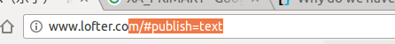

# xclip命令

## xclip的用途

在Linux系统下进行开发的程序员可能会遇到这样的困扰，使用vim等命令行编辑器时，想要复制文件内容到剪贴版，然后粘贴到桌面环境。但是如果直接用鼠标选中然后ctrl-c时，可能回复制到额外的空格或者缩进等不可打印的字符（或者说少复制一些）。而xclip可以用命令行实现，直接从文件中复制内容到桌面剪贴板，或者从桌面剪贴板中提取内容到命令行文件。

## 关于桌面剪贴板

在linux中有三个x-selection（也就是桌面环境的选择区域，博主不知道专业翻译是什么），分别是XA_PIRMARY、XA_SECONDARY和XA_CLIPBOARD（也就是我们常说的剪贴板）。

那么这三个选择区中分别存储了什么内容呢？我们可以简单的理解为，在桌面环境中：

XA_PRIMARY中存储了你当前用鼠标选中的内容，也就是下图中高亮的内容：

当选中内容之后，你可以点击鼠标中键来粘贴当前选中的内容

XA_SECONDARY可以暂时忽略它，因为就博主目前查到的资料，都建议不要在应用中使用到这个区域

XA_CLIPBOARD，也就是我们所熟知的剪贴板，我们通过ctrl-c（或者复制）操作的内容都存储在这个区域中

## xclip常用参数

`-i` 从标准输入或者一个文件中读入内容到指定的x-selection

`-o` 从指定的x-selection中输出内容到标准输出

`-selection` 选择特定的x-selection，primary、secondary、clipboard分别对应XA_PRIMARY、XA_SCONDARY、XA_CLIPBOARD

`-sel` 它是-seletion的简写

常用例子

从文件复制内容到剪贴板：

`xclip -i -sel clipboard myfile.txt`

从剪贴板输出内容到制定文件：

`xclip -o -sel clipboard > myfile.txt`

